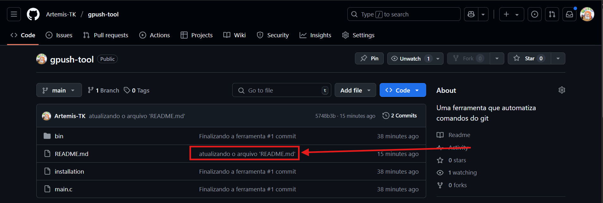

Bom, um commit é basicamente uma mensagem que aparece nos repositórios e  pode ser interpretada como um tipo de 'checkpoint', onde - se der algum erro no nosso código - podemos voltar para uma versão que não estava com erros.

Abeixo tem uma imagem de commits que foram feitos nesse proprio repositório

    

